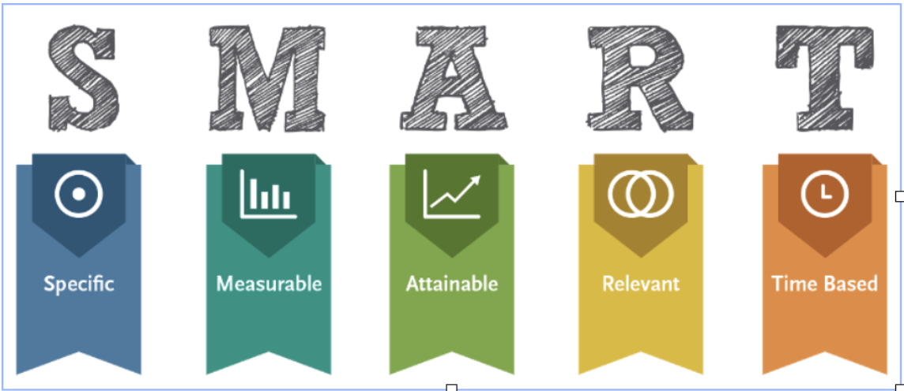

# Setting Goals

Goals will not only help you focus, but allow you to measure your progress.

If you need help setting goals, follow the SMART goal format.



Thinking about SMART goals can be really helpful in this case. SMART stands for Specific, measurable, attainable , realistic, and time constrained. If your goals aren’t these things, they’ll be much more difficult to evaluate.

_Examples of bad goals:_
- Learn to put search functionality into the user homepage
- Feel more comfortable with defining my abilities
- Commit something to OSS
- Build something using JavaScript

_Better Goals:_
- Write a useful script
- Continue to improve in testing and learn more about testing concepts like stubbing, mocking, and message chains
- Understand the basics of relational data modeling and relational data
- Become more of a go-to person for pairing and getting unstuck

## Action Steps
I find it helpful to add action steps to goals. These help break goals in to bite size pieces, making sure you're not scrambling to accomplish the goal at the last minute and keeping you on track.

Ask yourself these questions:  
- How will I know if I’m making progress?  
- What are the smaller things that need to be learned or done in order to accomplish this goal?  
- What is my plan for breaking this goal down into smaller parts in order to accomplish each of those one step at a time?

## Additional considerations
Each goal should have a purpose and you should think about goals in both a personal and professional capacity.

Think about having goals related to making yourself better, making your team better, and making the company better.

Think about what skills you want to improve. Where you want to be in a year and at the end of the quarter. What do you want to get better at?

```md
### Goal Template
**Timeframe:**  

**Goal 1**:  
**Reason(s) for goal:**

**What steps/actions can be taken to achieve this goal:**  
1.  
2.  
3.  
4.  

**Goal 2**:  
**Reason(s) for goal:**

**What steps/actions can be taken to achieve this goal:**  
1.  
2.  
3.  
4.  
```
